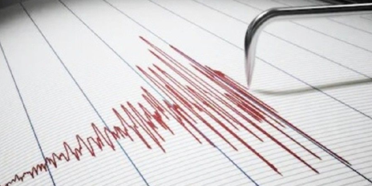
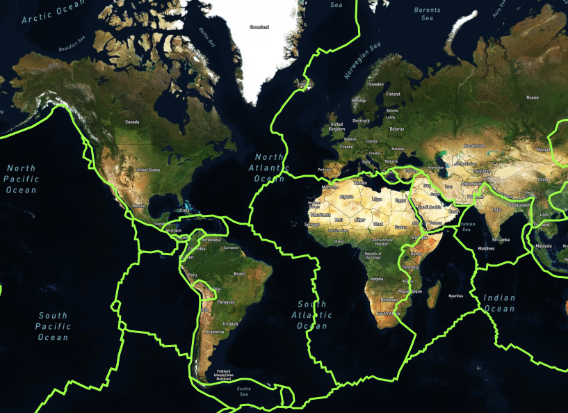
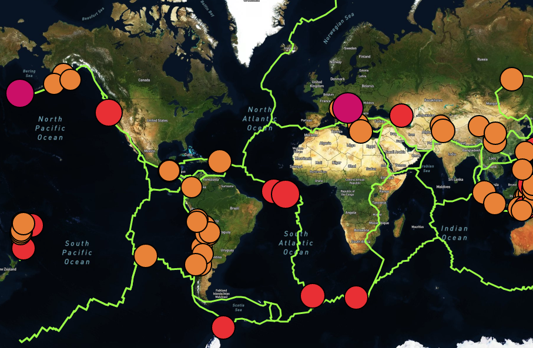
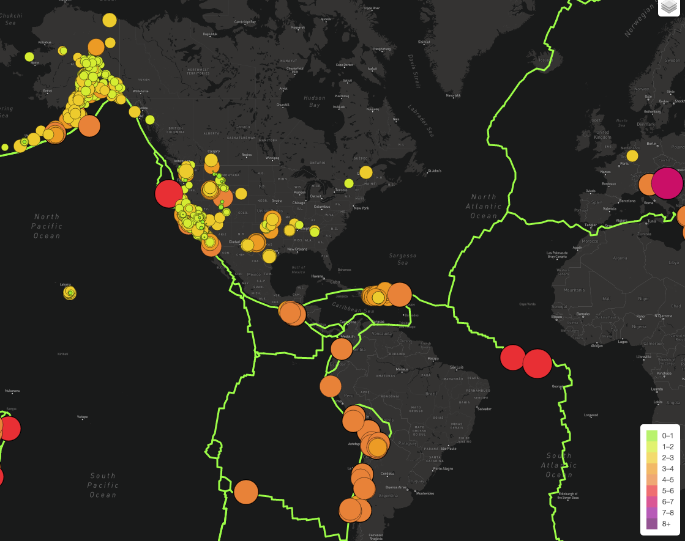
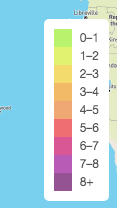
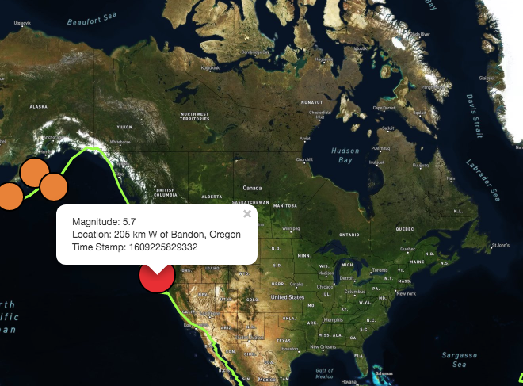

# Mapping Earthquakes
## Overview
 
Basil and Sadhana would like to see some improvements made to the maps they've been working on to track earthquakes around the globe.  Currently, the earthquakes from the past seven (7) days are captured and plotted on a map.  Each quake is color-coded and the size of the marker (radius) changes based on the magnitude of the event.  There are two views to choose from: a street view and satellite view.

### Objectives:
Now, Basil and Sadhana would like to see:

1.  the earthquake data in relation to the tectonic plates’ location on the earth,
2. all earthquakes with a **magnitude greater than 4.5** on the map (separately), and
3. a third map overlay.

### Resources:
The GeoJSON data used for the 3 data inputs are as follows:

1. Earthquakes recorded in the past 7 days from the USGS website: [https://earthquake.usgs.gov/earthquakes/feed/v1.0/summary/all_week.geojson
]()

2. Earthquakes from the past week with a **magnitude of 4.5 or greater** also from the USGS website: [https://earthquake.usgs.gov/earthquakes/feed/v1.0/summary/4.5_week.geojson]()  

3. Tectonic Plate Coordinates: [https://raw.githubusercontent.com/fraxen/tectonicplates/master/GeoJSON/PB2002_boundaries.json]()

### Tools:
With the use of **JavaScript** and the **D3.js** library, the coordinates and magnitudes of the earthquakes will be extracted from the GeoJSON data. 

The **Leaflet** library will be used to plot the data on a **Mapbox** map through an API request to interact with USGS website for the earthquake data.

## Deliverables
### Deliverable 1: Add Tectonic Plate Data

***D1 only: Tectonic Plates in Satellite view***
### Deliverable 2: Add Major Earthquake Data

***D1 and D2 only in Satellite view***
### Deliverable 3: Add an Additional Map

***The third map added is the "dark-v10" Mapbox style map: [mapbox://styles/mapbox/dark-v10
]()***

### Additional Features:
1. Additional magnitude ranges and associated colors were included in the legend to address both sets of Earthquake data: all earthquakes and major earthquakes. This allows the same 4.5 magnitude quake, for example, to have the same color on either data plot.  However, the 6 to 7, the 7 to 8, and the 8+ magnitude quakes have 3 new colors.  

2.  The weight of the outline of the markers for the **Major Earthquakes** was increased from 0.5 to 2.0 so provide a little differentiation when this layer is activated.

3. In addition to magnitude and locations, the time stamp of the quakes was added to the pop-up information linked to the marker for the **4.5 or greater magnitude** quake data.  *This is an area for improvement: to convert the TimeStamp to a readable date*.
